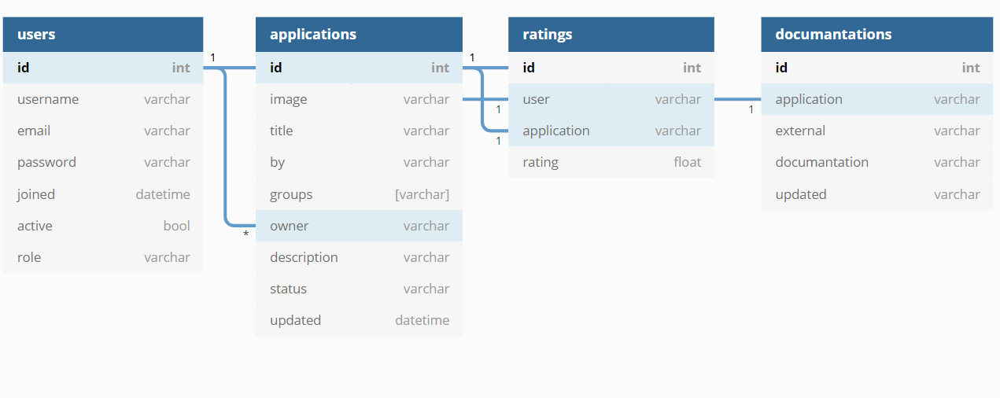

# App Listing API

A REST API for an app store like application project using `fastapi` and `dataset`, setup for easy deployment on `heroku`.

[](https://heroku.com/deploy)

## To Do
- [ ] External auth(Rally, PlatformPro)
- [ ] Change password
- [ ] Admin dashboard
- [ ] Websockets

## Development

Clone the repo

```sh
$ git clone https://github.com/Ju99ernaut/app-listing-server.git
$ cd app-listing-server
```

Create virtual enviroment

```sh
$ python -m venv venv
```

Activate virtual enviroment

Linux/MacOS: `source venv/bin/activate`
Windows: `.\venv\Scripts\Activate.ps1` or `.\venv\Scripts\activate`

Install dependencies

> Use `requirements.txt` in production

```sh
$ pip install -r requirements.dev.txt`
```

Run tests

```sh
$ cd api 
$ python -m pytest
$ cd ..
```

Run

```sh
$ python api/main.py -r t
```

The API should now be available for development at `http://127.0.0.1:8000` and the API documentation will be available at `/docs` or `/redoc`. During development a sqlite database will be setup by default and the schema will be setup automatically

[](schema.txt)

## Production

Depending on the type of database backend, you may also need to install a database specific driver package. For `MySQL`, this is `MySQLdb`, for `Postgres` its `psycopg2`. SQLite support is integrated into Python. By default `psycopg2` will be installed, if you're using `MySQL` then replace `psycopg2` with `MySQLdb` in `requirements.txt`.

### Enviroment Variables

| `Variable` | `Description` | `Required` |
|------------|---------------|------------|
| `DATABASE_URL` | Database connection URL | `true` |
| `POOL_SIZE` | Connection pool size | `false` |
| `MAX_OVERFLOW` | max_connections = pool_size + max_overflow | `false` |
| `ADMIN_USERNAME` | Admin username, allows access to admin only endpoints | `false` |
| `ADMIN_PASSWORD` | Admin password, allows access to admin only endpoints(This can be removed after initialization) | `false` |
| `ADMIN_EMAIL` | Admin email, allows access to admin only endpoints | `false` |
| `MAIL_USERNAME` | email address for your sending confirmation email. If blank user emails wont be verified. | `false` |
| `MAIL_PASSWORD` | Above email address password. If blank user emails wont be verified. | `false` |
| `BACKEND_URL` | Backend root URI used for email redirects e.g `https://backend.com`.(Required if MAIL_USERNAME and MAIL_PASSWORD are provided) | `false` |
| `FRONTEND_URL` | Frontend root URI used for email redirects e.g `https://frontend.com`.(Required if MAIL_USERNAME and MAIL_PASSWORD are provided) | `false` |
| `SECRET_KEY` | Application secret key(Not required but important to setup to avoid using default) | false |

### Config Variables

| `Variable` | `Description` | `Default` |
|------------|---------------|-----------|
| `database_connection` | Database connection URL(Used if `DATABASE_URL` isn't provided) | `sqlite:///data.db` |
| `reload` | Reloads server when a file changes | `False` |
| `host` | Bind socket to this host | `127.0.0.1` |
| `port` | Bind socket to this port | `8000` |
| `mail_username` | email address to send confirmation email(Can be used instead of `MAIL_USERNAME`) | ` ` |
| `mail_password` | email address password to send confirmation email(Can be used instead of `MAIL_PASSWORD`) | ` ` |
| `mail_port` | email TSL port | `587` |
| `mail_from` | preffered from name | `App Listing` |
| `mail_server` | your mail server | `smtp.gmail.com` |
| `backend` | Backend root used for email redirects(Can be used instead of `BACKEND_URL`) | `http://127.0.0.1:8000` |
| `frontend` | Frontend root used for email redirects(Can be used instead of `FRONTEND_URL`) | `http://127.0.0.1:3000` |

Config variables can be placed inside a `config.txt` file, check [`example-config.txt`](example-config.txt) or during startup e.g.

```sh
$ python api/main.py --host 0.0.0.0 --port 5467
```

Recomended python version in [runtime.txt](runtime.txt)

## License

MIT
